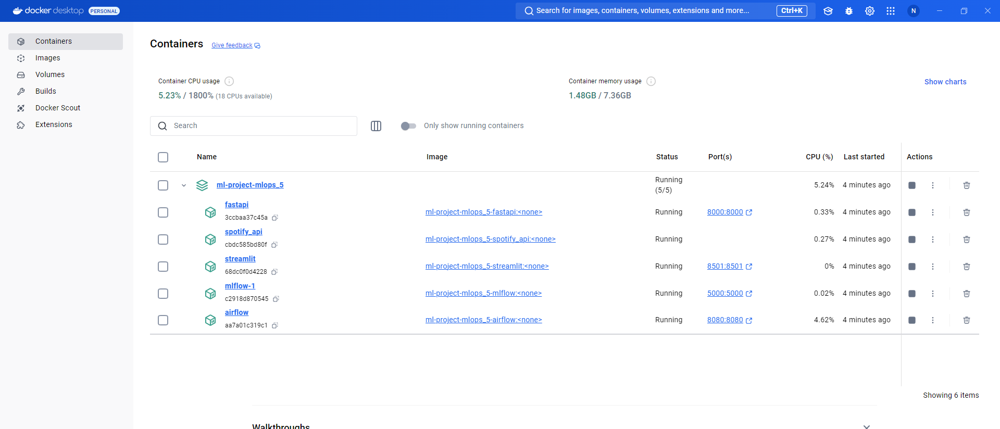
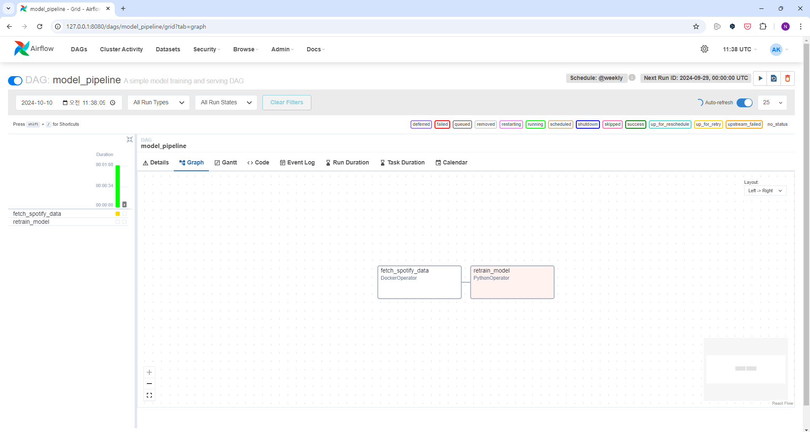
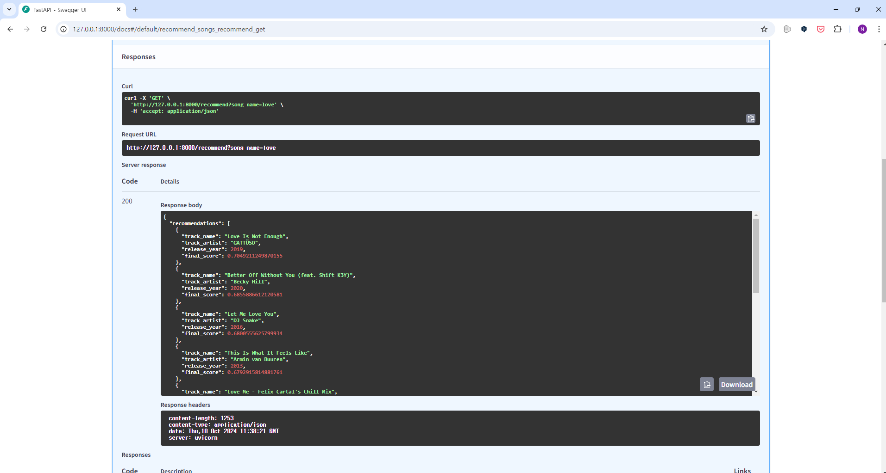
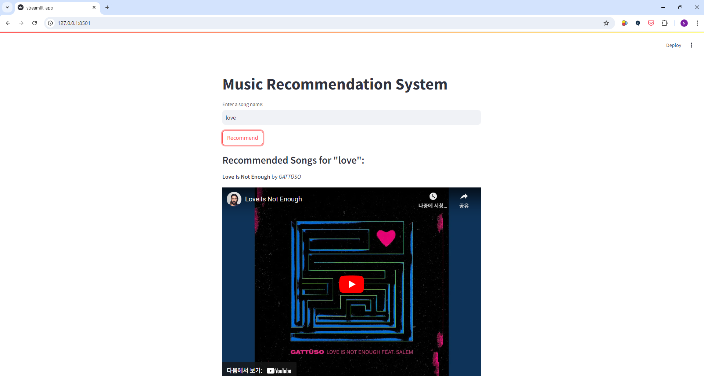

# Title (Please modify the title)
## Team

|  |  |  |  |  |
| :--------------------------------------------------------------: | :--------------------------------------------------------------: | :--------------------------------------------------------------: | :--------------------------------------------------------------: | :--------------------------------------------------------------: |
|            [주남정](https://github.com/UpstageAILab)             |            [조성수](https://github.com/UpstageAILab)             |            [권세진](https://github.com/UpstageAILab)             |            [김이준](https://github.com/UpstageAILab)             |            [김동호](https://github.com/UpstageAILab)             |
|                            팀장, 담당 역할                             |                            담당 역할                             |                            담당 역할                             |                            담당 역할                             |                            담당 역할                             |

### Task
- [x] ipynb 파일에 mlflow 적용
- [x] mlflow docker로 실행
- [x] fast api 적용 후 파이썬 모듈에서 mlflow 적용
- [x] airflow 구조 만들기
- [x] airflow와 mlflow 도커로 실행
- [x] streamlit 적용
- [ ] 데이터 수집 docker-compose에 추가
- [ ] 데이터 수집까지 포함해서 1-cycle 돌리기

### Screenshot
- #### Docker container


- #### Airflow


- #### FAST API


- #### Streamlit



## 0. Overview
### Environment
- _Write Development environment_

### Requirements
- _Write Requirements_

## 1. Competiton Info

### Overview

- _Write competition information_

### Timeline

- ex) January 10, 2024 - Start Date
- ex) February 10, 2024 - Final submission deadline

## 2. Components

### Directory

- _Insert your directory structure_

e.g.
```
├── code
│   ├── jupyter_notebooks
│   │   └── model_train.ipynb
│   └── train.py
├── docs
│   ├── pdf
│   │   └── (Template) [패스트캠퍼스] Upstage AI Lab 1기_그룹 스터디 .pptx
│   └── paper
└── input
    └── data
        ├── eval
        └── train
```

## 3. Data descrption

### Dataset overview

- _Explain using data_

### EDA

- _Describe your EDA process and step-by-step conclusion_

### Data Processing

- _Describe data processing process (e.g. Data Labeling, Data Cleaning..)_

## 4. Modeling

### Model descrition

- _Write model information and why your select this model_

### Modeling Process

- _Write model train and test process with capture_

## 5. Result

### Leader Board

- _Insert Leader Board Capture_
- _Write rank and score_

### Presentation

- _Insert your presentaion file(pdf) link_

## etc

### Meeting Log

- _Insert your meeting log link like Notion or Google Docs_

### Reference

- _Insert related reference_


